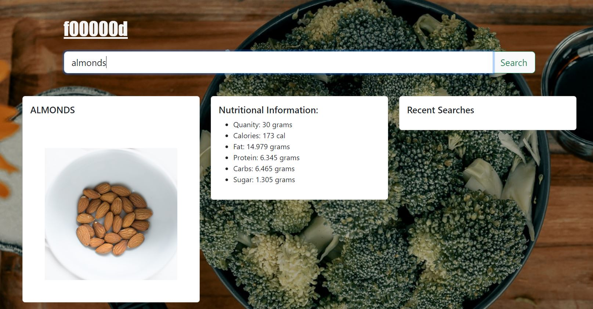

# F00000d

## Description and Requirements 

Our group will use everything we’ve learned over the past six modules to create a real-world front-end application that we’ll be able to showcase to potential employers. 

A user wants more nutritional information regarding the food they are eating on a daily basis. Our application allows you to search for ingredients, the search will provide a photo and nutritional facts. 

```
Be deployed to GitHub Pages.

Be interactive (i.e: accept and respond to user input).

Use at least two server-side APIs.

Does not use alerts, confirms, or prompts (use modals).

Use client-side storage to store persistent data.

Be responsive.

Have a polished UI.

Have a clean repository that meets quality coding standards (file structure, naming conventions, follows best practices for class/id-naming conventions, indentation, quality comments, etc.).

```

### Technologies Used

```
Bootstrap used for the CSS frame work

API Library for Nutrition analysis: https://www.edamam.com/

API Library for images: https://www.pexels.com/discover/


```

#### Mock-Up



##### Live Link 

Coming soon!

###### Future Developments 

Area to include suggested recipes for the searched ingredient.